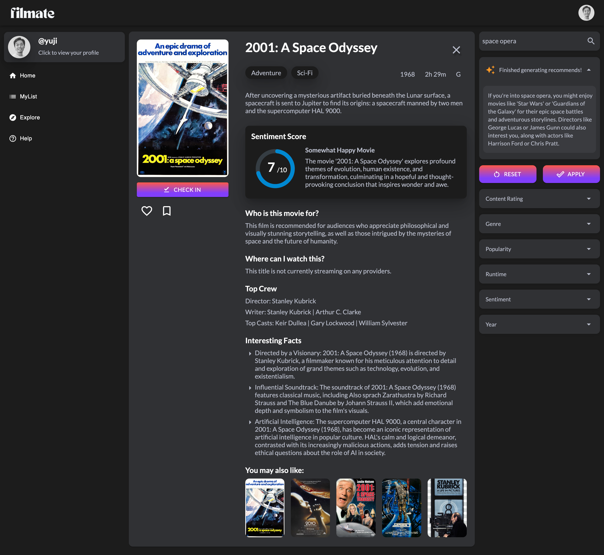
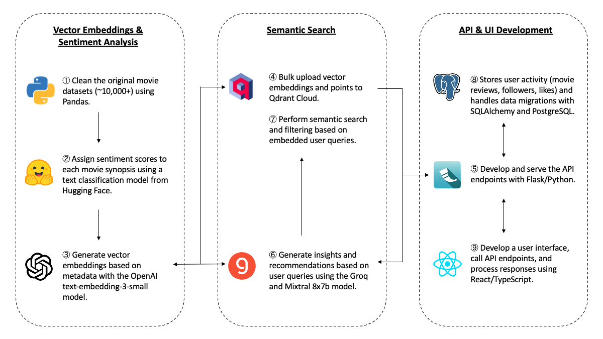

# Filmate AI 🎬

Movie finder + social platform app using OpenAI GPT-3.5 Turbo, Groq, and Qdrant.




## Features



### Text Vectorization & Sentiment Analysis

⚡ **Data Cleaning**: Uses Pandas for cleaning CSV data that contains 10,000+ movie records released from 1915 to 2024.  
⚡ **Sentiment Analysis**: Assigns sentiment scores and appropriate justifications to all movies using OpenAI GPT-3.5 Turbo and Hugging Face Transformers text classification model.  
⚡ **Text Vectorization**: Vectorizes movie metadata (e.g., titles, director and actor names, and synopsis) using the OpenAI embedding model.

### Semantic Search

⚡ **Data Storage**: Stores vector embeddings and payload in Qdrant Cloud.  
⚡ **Query Processing**: Vectorizes, filters, and generates insights from user queries using Groq (Mixtral 8x7b model).  
⚡ **Semantic Search**: Performs semantic searches based on vectorized user queries and filters.

### API & UI Development

⚡ **API Development**: Serves API endpoints using Flask (Python).  
⚡ **UI Development**: Serves the frontend interface using React (TypeScript, JavaScript, SASS).  
⚡ **User Authentication**: Handle user authentication (login, sign up, reset password) securely with Propelauth.  
⚡ **Data Management**: Stores user activity (movie reviews, followers, likes) and handles data migrations with SQLAlchemy and PostgreSQL.


## Setup

This application consists of a Flask backend and a React frontend. Follow these steps to set up your development environment:

### 0. Add Environment Variables
Create a `.env` file in the `./app` folder and add the following environment variables:

```
OPENAI_API_KEY=your_openai_api_key
QDRANT_API_KEY=your_qdrant_api_key
QDRANT_URL=your_qdrant_url
GROQ_API_KEY=your_groq_api_key
```

Ensure the `.env` file is kept secure and not shared, as it contains sensitive API keys.

### 1. Set Up Flask Backend
Navigate to the `./app` folder:

```
cd app
```

Create and activate a virtual environment using Python:

```
python -m venv venv
source venv/bin/activate  # On Windows, use venv\Scripts\activate
```

Install the required packages:

```
pip install -r requirements.txt
```

### 2. Set Up React Frontend
Navigate to the `./app/client` folder and install npm packages:

```
cd app/client
npm install
```

### 3. Start the App
Start the Flask server:

```
gunicorn -w 2 -b 0.0.0.0:5000 app:app
```

Start the React server:

```
npm start
```

Access the app in your browser at `http://localhost:3000`.

### 4. Build Static Files
To deploy the app, build the frontend static files:

```
npm run build
```

### 5. Deactivate the Virtual Environment
When you are finished, deactivate the virtual environment:

```
deactivate
```